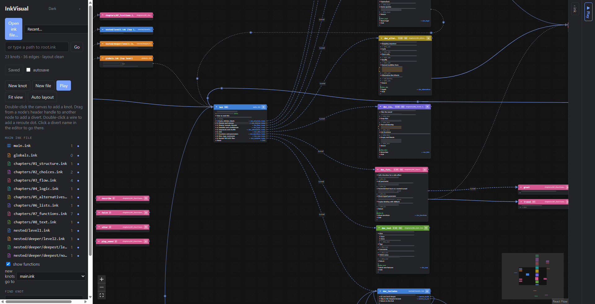

# InkVisual

A graph-based editor and viewer for inkle's [**ink**](https://www.inklestudios.com/ink/) narrative scripting language.

Every knot in your story is a card on a canvas. Every divert between knots is a wire. A card's body is a
compressed picture of that knot's structure — its choices, gathers, diverts and prose — and the raw ink is
edited in a docked editor beside the graph. InkVisual organises your script; it never rewrites your prose.

## What it is

InkVisual is a desktop app for writers who already have an ink project and want to see its shape. It reads
your `.ink` files straight from disk, follows every `INCLUDE`, and lays the knots out as a Twine-style map you
can drag around. Click a card and its ink appears in an editor on the right, with syntax highlighting and
clickable divert targets. Press Play and the story runs inside the app, lighting up the line it is on.

It is not a replacement for [Inky](https://github.com/inkle/inky). It reads and writes the same files, so you
can keep Inky open at the same time and use whichever one suits what you are doing.

## Download

Get the latest build from the **[Releases page](https://github.com/ifishbw/Ink-Visual-Editor/releases/latest)**.

| You are on | Take | Notes |
|---|---|---|
| Windows | the `Setup` `.exe` installer | Normal install, adds a Start-menu entry. Pick this unless you have a reason not to. |
| Windows, no admin rights / USB stick | the portable `.exe` | One file, run it where it sits, installs nothing. |
| Linux, any distro | the `.AppImage` | Mark it executable and run it. Works nearly everywhere. |
| Debian, Ubuntu, Mint | the `.deb` | `sudo apt install ./InkVisual*.deb` |

The Windows builds are **not code-signed**, so Windows shows a blue "Windows protected your PC" box the first
time you run one. That is expected. [INSTALL.md](docs/INSTALL.md) shows exactly what to click.

There is **no macOS build yet**. Mac users can build from source — see [CONTRIBUTING.md](CONTRIBUTING.md).

## Features

- **A card per knot.** Its body is a compressed structure preview: choices, gathers, stitches, diverts,
  condition pips, and prose drawn as bars whose width follows the length of the line. Indentation is weave
  depth. It reads the same at every zoom level.
- **Wires that point at real lines.** A divert's wire leaves the card at the exact line that writes `-> x`,
  and arrives at the stitch it names. Tunnels and threads get their own dash pattern.
- **A docked ink editor** with ink syntax highlighting, adjustable font size and a draggable divider. Click a
  preview row on a card to put the cursor on that source line.
- **Divert targets are links.** Click `-> forest` in the editor and the editor, the cursor and the camera all
  travel there. Hold Alt to edit the name instead.
- **Structural editing:** create knots (double-click the canvas), connect two knots by dragging from one
  card's header to another (which appends the divert to your ink), delete knots, create a knot from a red
  "missing target" stub, add a new `.ink` file (InkVisual writes the file and inserts the `INCLUDE`).
- **Play mode:** run the story in the app, step one line at a time, step backwards, run to the cursor, set
  breakpoints, watch and edit variables live, and paint coverage over the graph so you can see what you have
  never reached.
- **Undo and redo across everything** — typing and graph edits share one stack.
- **Live reload.** Edit the same files in Inky, VS Code or git and InkVisual picks the change up immediately.
- **Dark and light themes.** Dark by default, tuned to sit next to Inky.

## Quick start

1. Install the app — see [INSTALL.md](docs/INSTALL.md).
2. Launch InkVisual.
3. Click **Open ink file…** in the left-hand panel.
4. Pick the **root** `.ink` file of a project. For a tour, pick `examples/tech-demo/main.ink` from this repo,
   or the copy inside the installed app under `resources/examples/tech-demo/main.ink` — see
   [examples/README.md](examples/README.md) for where that folder is on each OS.
5. The graph appears. Click a card to edit its ink on the right. Click **Play** to run the story.

Then read the [User Guide](docs/USER_GUIDE.md), especially "Reading the canvas", which explains what every
mark on a card means.

## How it works

- **Your `.ink` files are the only source of truth.** InkVisual never regenerates ink from an internal model.
  Saving a file writes back exactly the text you typed, byte for byte; editing a knot replaces only that
  knot's slice of the file. Formatting, comments and blank lines elsewhere in the file are untouched.
- **Layout lives in a sidecar.** Node positions, sizes, collapsed flags, the camera and reroute dots go into a
  small JSON file next to your root script, named after it — `main.ink` gets `main.inkvisual.json`. Nothing
  about your story lives there. Delete it and InkVisual lays the graph out automatically again.
- **`INCLUDE` builds the project.** Open the root file and InkVisual follows every `INCLUDE` from it. As in
  `inklecate`, include paths resolve relative to the **root** file's folder, not the including file's.
- **External edits are picked up live.** InkVisual watches the project folder. Save in Inky or check out a
  branch in git and the graph updates. If a file changed on disk while you had unsaved edits to it, a banner
  asks which version wins — nothing is overwritten silently.
- **It works alongside Inky.** Same files, no lock, no project format of its own.

## Examples

Two projects ship with the app and live in this repo:

- [`examples/tech-demo/`](examples/tech-demo/) — a playable tour of ink's features across nine chapters and
  several files, deliberately built to exercise nested `INCLUDE`s. Root file: `main.ink`.
- [`examples/saving-tortuga/`](examples/saving-tortuga/) — a single-file, 795-line story built around tunnels
  and `LIST`s. Root file: `SavingTortugaRework.ink`.

See [examples/README.md](examples/README.md).

## Documentation

- [User Guide](docs/USER_GUIDE.md) — the manual: reading the canvas, editing, play mode, shortcuts.
- [Install](docs/INSTALL.md) — download and install, per operating system.
- [FAQ](docs/FAQ.md) — troubleshooting.
- [Contributing](CONTRIBUTING.md) — building from source, the codebase, how to help.

## Building from source

You need Node.js and npm. In short: `npm install`, then `npm run dev:app` to develop, or `npm run dist` to
build an installer for your own platform. [CONTRIBUTING.md](CONTRIBUTING.md) has the details and a map of the
codebase.

## Licence and credits

MIT — see [LICENSE](LICENSE).

InkVisual stands on other people's work:

- **ink** and **inkjs** by [inkle](https://www.inklestudios.com/) — the language, and the parser and runtime
  InkVisual uses to build the graph and play the story.
- **[React Flow](https://reactflow.dev/)** (`@xyflow/react`) — the canvas.
- **[CodeMirror 6](https://codemirror.net/)** — the ink editor, with ink language support from
  `@mavnn/codemirror-lang-ink`.
- **[dagre](https://github.com/dagrejs/dagre)** — automatic layout.
- **[Electron](https://www.electronjs.org/)** — the desktop shell.

InkVisual is an independent project and is not affiliated with or endorsed by inkle.
